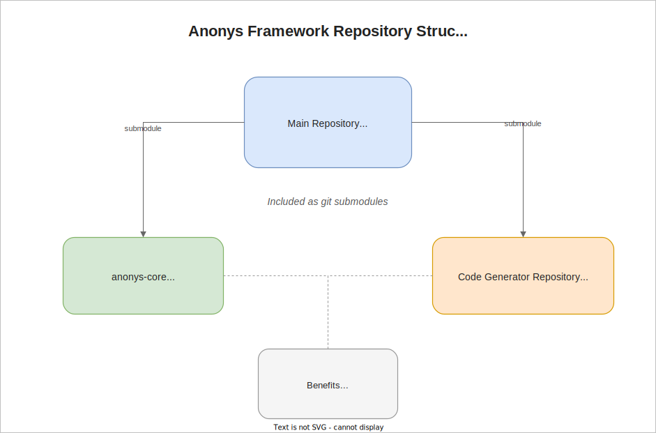
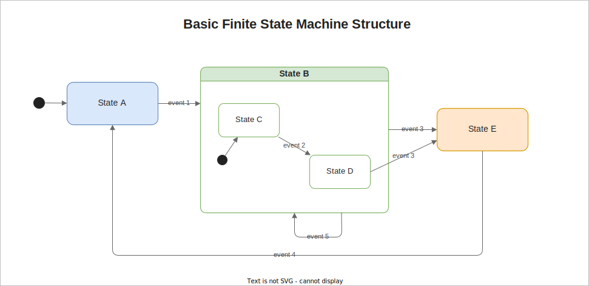
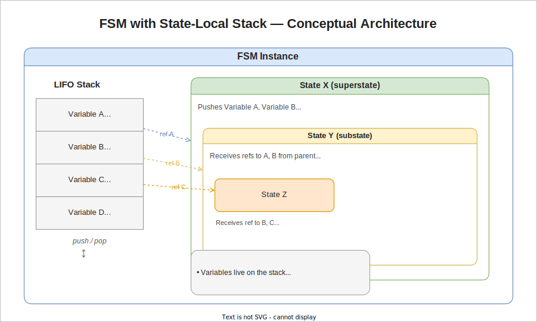
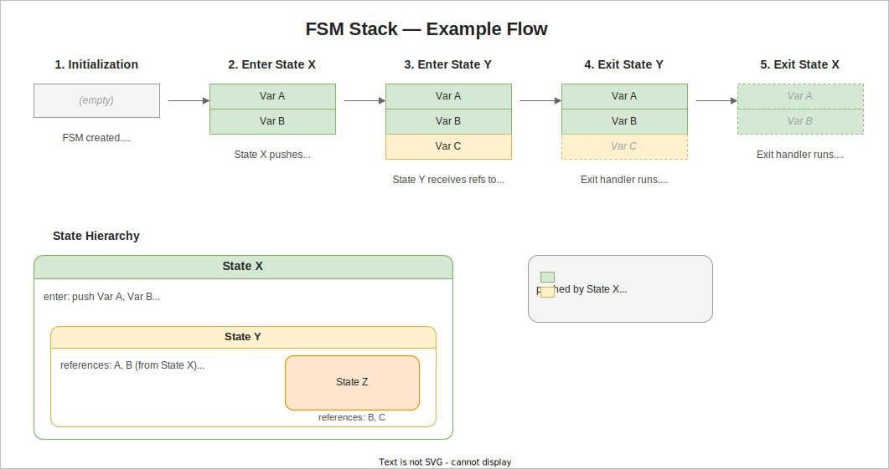
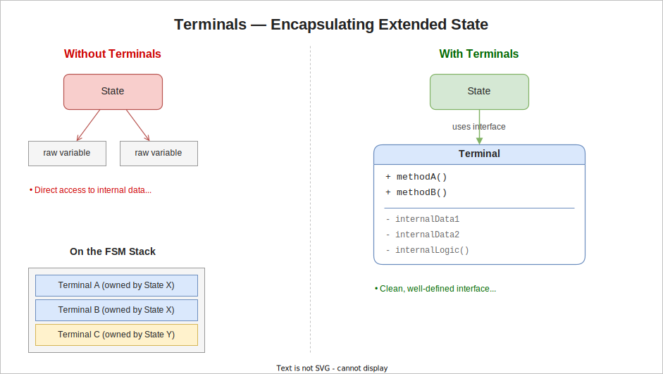

# Anonys – State Machine Framework

Anonys is a modular framework for implementing hierarchical finite state machines with well-structured extended state management.

Hierarchical FSMs allow states to contain substates, enabling shared behavior and clear structural decomposition. Extended state refers to the additional data a state machine carries alongside its current state — variables such as counters, buffers, configuration values, or references to external resources that influence behavior but are not part of the state topology itself. Anonys introduces a disciplined model for managing this extended state: data has clearly defined ownership, explicit lifetimes, and controlled access.

## Repository Structure

It consists of three repositories:

- Main Repository (this repository)  
  Contains:  
  - Conceptual documentation (including this document)  
  - High-level architecture  
  - Integration examples  

- anonys-core  
  Provides:  
  - The event-handling library  
  - Core runtime primitives for state machine execution  

- Code Generator Repository  
  Provides:  
  - Tooling to generate boilerplate and state machine structures  
  - Support for consistent and scalable FSM definitions  

The two supporting repositories (anonys-core and the code generator) are included in the main repository as git submodules, ensuring:

- Version alignment  
- Reproducible builds  
- Clear separation of concerns



---

# Finite State Machines (FSM) – Overview

A Finite State Machine (FSM) is a computational model that represents a system as a finite set of states with transitions between them. At any point in time, the system is in exactly one state, and transitions are triggered by events or conditions.

## Core Concepts

- State: A well-defined condition or mode of the system  
- Transition: A directed edge between states, triggered by events  
- Event: An input that may cause a transition  
- Initial State: The starting point of the FSM  
- Actions: Logic executed on transitions or during state entry/exit  
- Extended State: Additional data associated with the state machine beyond the current state identity — such as counters, buffers, configuration values, or references to external resources. Extended state variables persist across transitions and influence how the FSM behaves within a given state.  

FSMs are especially useful for modeling deterministic, event-driven behavior with clear control flow.

---

## Basic FSM Structure



---

# FSM with State-Local Stack (Extended State Model)

## Motivation

A basic FSM has no memory beyond the current state — all behavior is determined solely by which state is active. Extended FSMs (EFSMs) address this by introducing additional variables that persist across transitions. However, in many frameworks these extended state variables are visible to all states of the FSM, even if they are conceptually out of scope for the currently active state. Any state can freely read or modify data that belongs to another state's lifecycle. In hierarchical FSMs this problem compounds: substates can silently depend on variables that a parent state owns, and that dependency is never made explicit. The result is unclear ownership, hidden coupling, and fragile behavior when states are added, reordered, or removed.

This model introduces a strict LIFO stack per state machine, ensuring well-defined variable lifetime and controlled data flow.

---

## Core Concept

Each FSM instance maintains its own LIFO stack that holds extended state variables.

- Variables are pushed and popped in strict stack order  
- Variables are mutable  
- Access is granted only via explicitly passed references  
- No global or implicit shared state exists  

---

## Controlled Data Flow

- Substates cannot access the stack directly  
- Instead, parent states:  
  - Select relevant variables  
  - Pass references explicitly  

This creates:

- Clear data ownership  
- Explicit dependencies  
- Reduced coupling  

---

## Conceptual Architecture



---

## Execution Model

1. Initialization  
   - FSM is instantiated  
   - Constructor initializes base variables and pushes them onto the stack  

2. State Entry  
   - State may:  
     - Push additional variables onto the stack  
     - Request references to existing variables  

3. Substate Execution  
   - Parent passes selected references  
   - Substate operates exclusively on those references  

4. State Exit  
   - State may:  
     - Execute cleanup logic  
     - Pop variables from the stack  

5. Destruction  
   - Remaining stack variables are cleaned up via destructors  

---

## Example Flow



---

# Terminals (Encapsulation of Extended State)

## Motivation

Directly exposing raw variables—even via references—can lead to:

- Tight coupling  
- Poor abstraction  
- Fragile interfaces  

To address this, extended state variables should be encapsulated.

---

## Definition

A Terminal is a helper class that encapsulates one or more extended state variables and exposes a clean, well-defined interface.

---

## Properties of Terminals

- Encapsulate internal data and logic  
- Provide controlled access via methods  
- Are stored on the FSM stack like any other variable  
- Are passed by reference to substates  

---

## Benefits

1. Abstraction  
   - Internal representation can change without affecting states  
   - States interact only via defined methods  

2. Safety  
   - Prevents unintended or invalid manipulation of raw data  

3. Reusability  
   - Terminals can be reused across different state machines  

4. Clarity  
   - Makes data flow and responsibilities explicit  

---

## Example Structure



---

## Design Recommendation

- Prefer Terminals over primitive variables  
- Pass only the required terminals to substates  
- Keep terminal interfaces minimal and intention-revealing

---

# Framework Scope and Boundaries

Anonys provides the core state machine engine — the runtime that manages states, transitions, extended state lifetime, and the hierarchical stack model. It does **not** include platform-specific infrastructure. The following services must be implemented by the user and are injected into the framework at initialization:

## TimerService

The framework defines a `TimerService` interface with `startTimer` and `stopTimers` methods. The actual timer implementation — whether based on hardware timers, OS timers, or a simulated clock — must be provided by the user. The framework's `Timer` class (used inside states) delegates to this service and handles automatic cleanup via RAII: when a state is exited, its `Timer` destructor stops any active timeout.

## TracingService

An optional `TracingService` can be registered to receive callbacks for state entry, state exit, handled events, and unhandled events. The framework calls these hooks at the appropriate points. The user implements the interface to produce log output, record traces, or feed monitoring tools.

## Event Buffering and Dispatch

The framework processes one event at a time via `FsmPool::handleEvent`. It does **not** provide an event queue, event loop, or scheduling mechanism. The infrastructure to buffer events, prioritize them, and dispatch them to the FSM pool must be built by the user. This includes interrupt-safe queuing on embedded platforms and thread-safe dispatch in multithreaded environments.

## EventSenderService

States may need to send events to the same or other state machines (e.g. a countdown reaching zero sending a Play event). The framework does not provide this capability directly. Instead, the user implements an `EventSenderService` (or equivalent) and makes it available to states via a terminal. The service is responsible for enqueuing or dispatching the event appropriately for the target platform.

## Event and Terminal Types

All event structs and terminal classes are user-defined. Events are plain C++ types (typically empty `struct`s, or `class`es with payload data). Terminals are user-defined classes that encapsulate extended state and provide a domain-specific interface.

---

# Transitions and Actions

## Transition Types

When an event handler returns a state pointer, the framework executes a transition. The following transition types are supported:

**Regular transition** — The handler returns a pointer to a different state. The framework exits states from the current depth up to the lowest common ancestor of the source and target, then enters states from that ancestor down to the target state. Enter and exit handlers are called in the expected order.

**Self-transition** — The handler returns a pointer to the state it is already in (e.g. `return &Fsm::Idle` while in Idle). The framework exits the current state (calling its exit handler and destroying its `Me` struct) and immediately re-enters it (constructing a new `Me` struct and calling enter). This effectively reinitializes the state.

**Handled, no transition** — The handler returns `nullptr`. The event is consumed but the state machine stays exactly where it is. No exit or enter handlers are called.

**Unhandled** — The handler returns `&DummyStates::Unhandled`. The event is not consumed at this level and bubbles up to the parent state. If no state in the hierarchy handles the event, it is silently discarded (or traced as unhandled if a `TracingService` is registered).

## Transition Actions

In this framework, the **transition action** (the code in the event handler that runs before returning the target state) is executed while the **source state is still active**. This differs from the default UML statechart semantics, where the transition action is conceptually executed in the scope of the lowest common ancestor (LCA) of the source and target states — meaning state exit has already occurred before the action runs.

In Anonys, the sequence is:

1. Event handler runs in the source state (transition action executes here, `Me` struct is still alive)  
2. Handler returns the target state  
3. Framework exits states up to the LCA  
4. Framework enters states down to the target  

This design means the handler has full access to the source state's extended state (`Me` members, terminal references) when deciding and preparing the transition.

---

# The Me Struct — Constexpr State Polymorphism

## Concept

Every state has a `Me` struct that defines its extended state members. The framework uses a form of **constexpr polymorphism**: each state's `StateDef` is a compile-time constant that carries function pointers to `liveCycle`, `handleEvent`, and `getMembersSize`. These function pointers are the polymorphic dispatch — the `FsmCore` engine calls them uniformly without knowing the concrete `Me` type of any state.

The `Me` struct is placement-new'd into a contiguous stack buffer when a state is entered, and explicitly destroyed when it is exited. This means:

- No heap allocation  
- Deterministic lifetime  
- No virtual functions on state types  

## Members

The `Me` struct contains the extended state for a single state. Its members fall into three categories:

1. **Timer** — If the state uses timeouts, the first member is an `anonys::Timer`. Its destructor automatically stops active timers when the state is exited.

2. **Referenced terminals** — References (`&`) to terminal objects defined by a superstate or passed from outside the FSM. These are wired by the generated `liveCycle` function from the Terminals struct.

3. **Published terminals** — Value members that this state owns and exposes to its substates. The generated `liveCycle` function registers pointers to these in the Terminals struct on enter, and clears them on exit.

## Example

```cpp
struct Me {
    anonys::Timer timer;            // timeout support
    terminals::Std& std;            // referenced from outside
    terminals::Counter counter{};   // published to substates
    terminals::Mixer mixer{};       // published to substates
};
```

The generated `liveCycle` function takes care of construction and wiring:
- On enter: placement-new constructs `Me` with references from the Terminals struct, then registers published terminals, then calls the user-defined `enter(Me&)` function.
- On exit: calls the user-defined `exit(Me&)`, clears published terminal pointers, then explicitly destructs `Me`.

---

# FsmPool — Managing State Machine Instances

## Overview

The `FsmPool` is a generated class that owns and manages all `FsmCore` instances for a given project. It provides:

- A flat array of `FsmCore` objects (one per FSM)  
- A pre-allocated, aligned memory buffer per FSM (used as the stack for `Me` structs)  
- A Terminals struct per FSM (holds pointers to all terminal objects)  

## Initialization

For each FSM, the `FsmPool` generates an `initializeXxx` method. This method accepts external dependencies as parameters — typically a `TimerService` reference, plus any terminal objects that are only *referenced* by states but never *published* by any state (i.e. objects that live outside the state machine).

```cpp
// Example1: Jukebox FSM needs a TimerService and a Std terminal
fsmPool.initializeJukebox(timerService, stdTerminal);

// Example2: Washer FSM needs a TimerService, Motor, and Valve
fsmPool.initializeWasher(timerService, motor, valve);
```

The `initialize` method wires the timer core, stores the external terminal pointers in the Terminals struct, and prepares the aligned buffer.

## Start

After all FSMs are initialized, calling `fsmPool.start()` triggers the initial transition for each FSM — entering its initial state and calling the corresponding enter handler.

## Event Dispatch

Events are dispatched to a specific FSM via:

```cpp
fsmPool.handleEvent(fsmId, event);
fsmPool.handleTimeoutEvent(fsmId, depth, eventId);
```

The `FsmPool` validates the `FsmId` and delegates to the corresponding `FsmCore` instance.

## Tracing

A `TracingService` can be registered globally (for all FSMs) or per individual FSM:

```cpp
fsmPool.setTracingService(&tracingService);              // all FSMs
fsmPool.setTracingService(FsmId::Jukebox, &tracingService);  // one FSM
```

---

# Demo and Testing Concept

The examples in this repository include a combined demo and test application. Both share the same infrastructure and run in a single executable.

## Architecture

A `Setup` struct wires everything together: it creates the test implementations of all services (`TestTimerService`, `TestEventSenderService`, `TestLog`, `TestTracingService`), the terminal objects, and the `FsmPool`. The setup calls the generated `initialize` method and registers the tracing service.

An `Executor` class serves as the central event dispatcher. It dequeues events from the `TestEventSenderService` (events sent by states) and timeouts from the `TestTimerService` (simulated timer expiry), and dispatches them to the `FsmPool`. During demo mode, it also handles direct user-initiated events.

## Test Mode

Tests use an **ordered-expectation model**: before triggering an action, the test records the exact sequence of expected callbacks — tracing calls (enter, exit, handled, unhandled) and log writes. When the action executes and the framework calls the test services, each callback checks itself against the next expected entry. After the action completes, the test verifies the expectation queue is empty.

```
Expected::tracingTraceEnterState(FsmId::Jukebox, 1);   // expect enter Off
Expected::logWrite(Message::EnterOff);                   // expect log
fsmPool.start();                                          // trigger
Expected::check();                                        // verify
```

This approach validates not just the final state, but the exact sequence of side effects — including intermediate state transitions, event bubbling, and timer interactions.

## Demo Mode

The demo provides an interactive command-line interface. The user types short commands (`on`, `off`, `coin`, `play`, `pause`, `skip`, etc.) to send events to the FSM. The tracing service prints each state entry, exit, and event dispatch in real time. Queued events (sent by states via the `EventSenderService`) and pending timeouts can be dispatched manually with dedicated commands, giving full control over execution order.

This makes it possible to observe the FSM's behavior step by step, explore edge cases interactively, and understand the transition sequences without a debugger.

---

# Additional Examples

The examples in this repository (`Example1`, `Example2`) target a desktop platform (Windows / VS Code / CMake) for development and testing.

Additional embedded examples targeting different platforms (e.g. ARM Cortex-M, ESP32, Arduino) will be provided in branches prefixed with `examples/` — for instance `examples/stm32`, `examples/esp32`. These branches demonstrate how to integrate the framework with platform-specific timer services, event queues, and I/O.
